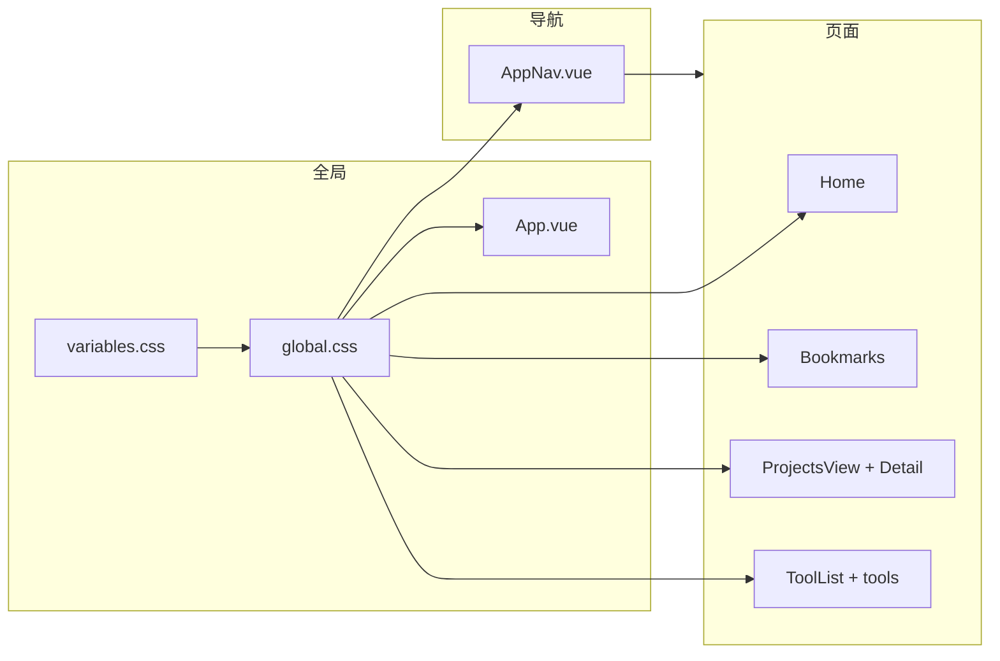

# 个人博客项目移动端适配计划

- **技术栈**: Vue 3 + Vite + 原生 CSS + CSS 变量，无 UI 库。
- **已有响应式**: `index.html` 已设 viewport；全站统一使用 `@media (max-width: 900px)`；`[global.css](src/assets/styles/global.css)` 仅对 `.page-content` 做左右 padding 收窄；`[AppNav.vue](src/components/layout/AppNav.vue)` 仅收窄 padding/gap，**导航链接仍全部平铺**，小屏易拥挤或换行。
- **各页面**: [Home.vue](src/views/Home.vue)、[BookmarksView.vue](src/views/bookmarks/BookmarksView.vue) 及部分工具页（Base64、ColorConvert、JsonFormat、ImageCompress）已有 900px 媒体查询；**ProjectsView、ProjectDetail、ToolList** 无任何移动端样式。
- **缺失**: 小屏导航方案、多级断点/设计 token、安全区域、触控目标与 Toast 小屏表现、未适配页面的补齐。

---

## 1. 断点与设计 Token 统一

**目标**: 避免各处硬编码 `900px`，便于后续维护与扩展。

- 在 `[variables.css](src/assets/styles/variables.css)` 中增加**仅用于媒体查询**的 CSS 自定义属性（或注释中的规范），例如：
  - `--bp-tablet: 900px`（当前统一断点）
  - `--bp-mobile: 600px`（可选，用于更小屏的进一步收窄）
- 在 `[global.css](src/assets/styles/global.css)` 及所有使用断点处，将 `900px` 改为使用 `var(--bp-tablet)`（若采用变量）或保持 900px 但在 variables 中文档化「移动端断点 = 900px」。
- **可选**: 在 variables 中增加移动端专用 token（如 `--page-padding-mobile: 16px`），在 global 的 `.page-content` 媒体查询中引用，保证与各页面 padding 一致。

**影响**: 仅样式与变量，无破坏性；各页面媒体查询可逐步替换为变量引用。

---

## 2. 导航在小屏的交互与布局

**目标**: 在 < 900px（尤其是 < 600px）时，导航不挤、可点击、符合触控习惯。

- **方案选型**（二选一，建议 A）:
  - **A. 汉堡菜单 + 抽屉**: 在 `max-width: 900px` 时隐藏 `.nav-links`，显示汉堡图标按钮；点击后从右侧（或顶部下方）滑出抽屉，内放 logo（可选）、nav 链接、语言、主题；抽屉外遮罩点击关闭；路由变化时关闭抽屉。
  - **B. 导航折叠为下拉**: 将「导航」收成一个下拉按钮，点击展开为竖向列表，占位在 nav 栏下方。实现更简单，但扩展性略逊。
- **实现要点**:
  - 在 `[AppNav.vue](src/components/layout/AppNav.vue)` 中增加：`isMenuOpen` 状态、汉堡图标按钮（仅 900px 以下显示）、抽屉/折叠层（含 `navConfig` 链接 + 语言 + 主题），并绑定 `aria-expanded`、`aria-label`。
  - 抽屉层建议使用 `position: fixed` + `transform`/`opacity` 做动画，z-index 高于主内容、低于 Toast。
  - 小屏下语言与主题放入抽屉内，避免顶栏元素过多；或保留在顶栏与汉堡并排（需保证触控目标 ≥ 44px）。
- **样式**: 抽屉内链接竖向排列、足够 padding，使触控目标 ≥ 44px；与现有 `--nav`、`--surface` 等变量保持一致。

**影响**: 仅 `AppNav.vue` 及可能少量全局样式（如 body 锁定滚动）；需在真机或 DevTools 移动模式下验证焦点与键盘/屏幕阅读器。

---

## 3. 全局布局与公共组件

- **主内容区**: `[App.vue](src/App.vue)` 中 `main.main-wrap` 使用内联 `padding-top: 58px`。建议改为 class，在 global 或 App.vue 的媒体查询中在 900px 以下保持或微调（例如 56px），避免固定高度与导航实际高度不一致。
- **安全区域**: 在 `[variables.css](src/assets/styles/variables.css)` 或 global 中，为固定定位元素（nav、Toast）增加 `padding-left: env(safe-area-inset-left)` 等（按需），避免刘海/横条遮挡。
- **Toast**: `[global.css](src/assets/styles/global.css)` 中 `#toast` 与 App.vue 中 `.toast-el` 存在重复；且 `white-space: nowrap` 在窄屏会溢出。建议：统一使用一处样式（如仅保留 `#toast` 或仅保留 class），并在 900px 以下改为 `white-space: normal`、`max-width: calc(100vw - 32px)`、`left/right` 留边，避免贴边或与导航重叠。

**影响**: 全局布局与 Toast 表现；需回归全站弹 Toast 的页面。

---

## 4. 各页面移动端样式补齐与统一

采用「先全局后页面」：先保证 [global.css](src/assets/styles/global.css) 的 `.page-content`、`.page-header` 在 900px 下 padding、换行合理，再逐页检查。

| 页面/组件             | 当前状态                                                  | 建议改动                                                                            |
| ----------------- | ----------------------------------------------------- | ------------------------------------------------------------------------------- |
| **Home**          | 已有 900px：hero 单列、隐藏 hero-card、padding 16px            | 检查 hero 标题字号在小屏是否过大、按钮是否堆叠良好；mq-wrap 横向滚动在窄屏是否正常。                               |
| **Bookmarks**     | 已有 900px：`.fg` 单列                                     | 检查表单/输入框、下拉、按钮组是否横向溢出；列表项是否可读。                                                  |
| **ProjectsView**  | 无媒体查询                                                 | 增加 900px：列表/卡片单列、左右 padding 与 global 一致（16px）、标题与筛选项换行。                         |
| **ProjectDetail** | 无媒体查询                                                 | 增加 900px：内容区 padding、图片/媒体 max-width:100%、任何多列布局改为单列。                           |
| **ToolList**      | 无媒体查询                                                 | 增加 900px：工具卡片网格改为单列或两列小卡、padding 与 global 一致。                                   |
| **各工具页**          | Base64/ColorConvert/JsonFormat/ImageCompress 已有 900px | 逐页检查：左右栏是否在小屏改为上下堆叠、输入/输出区是否可滚动、按钮不挤在一行；未适配的如 ImageConvert、Timestamp 等补齐 900px。 |

**实施顺序建议**: global → AppNav → Home/Bookmarks（微调）→ ProjectsView → ProjectDetail → ToolList → 各工具页。

---

## 5. 触控与可访问性

- **触控目标**: 对导航链接、汉堡按钮、语言/主题按钮、主要 CTA（如「查看项目」「探索工具」）、工具页的按钮与可点击图标，保证**最小约 44×44px**（可配合 padding 或 min-height/min-width），在对应组件的 900px 媒体查询中调整。
- **字体**: 全局 `font-size: 15px` 可保留；检查 10px/11px 的辅助文字在移动端是否过小，必要时在 900px 下设为最小 12px。
- **焦点与 a11y**: 抽屉打开时焦点移入抽屉、关闭时回到汉堡按钮；为汉堡按钮与抽屉提供 `aria-label`、`aria-expanded`。

---

## 6. 验收与文档

- **自检**: 在 Chrome DevTools 设备模拟（375×667、390×844 等）及真机（如有）上逐页走读：导航展开/收起、首页/书签/项目/工具列表/工具详情、Toast 展示。
- **日志**: 按项目规范在 `doc/logs/YYYY-MM-DD.md` 记录「移动端适配」的变更范围与影响（断点统一、导航、全局、各页面）。

---

## 架构关系简图

---

## 风险与注意

- **导航方案**: 若采用抽屉，需处理「路由变化时关闭」「焦点陷阱」，避免与 vue-router 过渡动画冲突。
- **向下兼容**: 仅增加媒体查询与 class，不删除现有桌面样式，保证大屏行为不变。
- **性能**: 避免在 resize 中频繁读写 DOM；抽屉显隐用 CSS transition 即可，无需复杂 JS 动画库。

